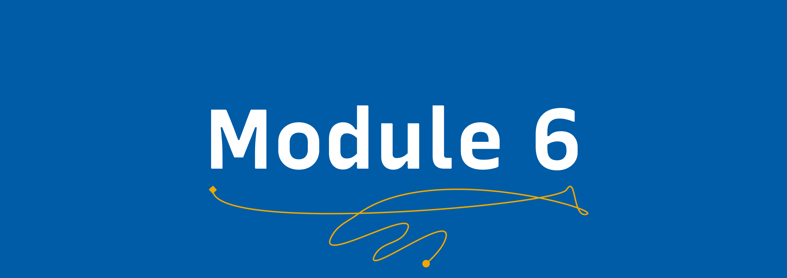

# Program Design 👨🏾‍💻 👩🏾‍💻

## Learning Goals

By the end of this module, you will:
- Understand what takes to create a good tech program for students.
- Be able to design a program proposal and  strategically plan on how to implement.
- Be able to design a tech program with sustainability, inclusiveness and impact on mind.

## Video 📹

### Video author ( Justin Shaw )

Who is Justin Shaw?

Justin Shaw is a performer and writer originally from Prince Edward Island, and if you’re also from Prince Edward Island, his dad probably knows your dad. 

### Video Content

[Watch the video on YouTube](https://www.ted.com/talks/justin_shaw_how_to_plan_a_proposal)

## Exercise  📝 📖

The exercise for this module is to create a program proposal.

## Resources  📖

- [How to design tech programs for students ?](https://www.edutopia.org/article/how-design-tech-programs-prepare-students-future/)

- [Hackathon Templates](https://guide.mlh.io/general-information/creating-your-hackathon-schedule/general-mlh-tips)

## Module Completion ✅

This module is complete when:
-   You have completed the writing for a hackathon proposal.
-   You have followed the instructions to submit.
-   A reviewer merges your pull request.