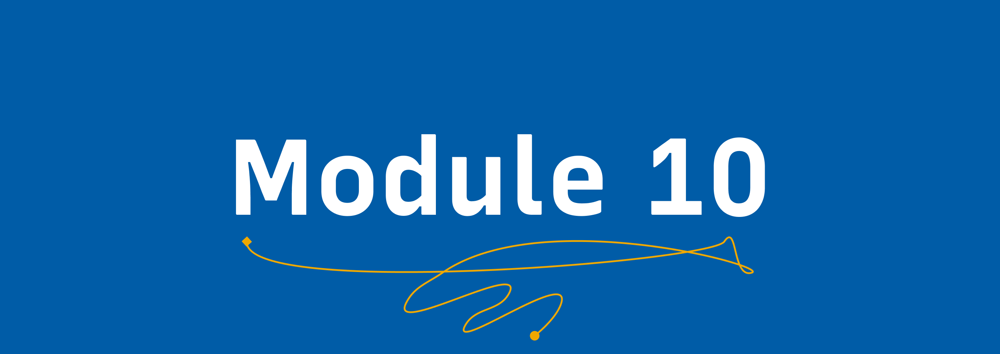

# Introduction to Git 🗃

## Learning Goals 🥅
By the end of this module, you will:
-   Understand a basic Git workflow.
-   Understand how to resolve merge conflicts.
-   Sharpened your understanding by explaining Git to others.

## Meet the trainers 🍎

Patrick McKenna delivers the content in this module.

### Patrick McKenna

</img>

Patrick is our former data scientist at GitHub. Patrick first joined GitHub on the Training Team, where he enjoyed helping others understand the power and beauty of Git and GitHub.
Patrick started with Git and GitHub while developing software for a neutrino physics lab. In prior years, he spent a great deal of time tutoring high school and college students in a variety of subjects. 

## Video 📹

[Watch the video on YouTube](https://www.youtube.com/watch?v=Gsep73H3KZM&list=PLIRjfNq867bcqbF_DVi7iTDnc8JoWNPVT&index=5)

## Exercise 📝

The exercise in this module is to explain Git and various Git concepts. 

## Resources 📖

-   [Oh Shit Git](https://ohshitgit.com)
-   [GitHub's Learning Lab](lab.github.com)
-   [Git in Practice, a free opinionated, advanced book on Git](https://github.com/GitInPractice/GitInPractice)

## Module Completion ✅

This module is complete when:
-   You have completed the Git explainer.
-   You have followed the instructions to submit
-   A reviewer merges your pull request.

