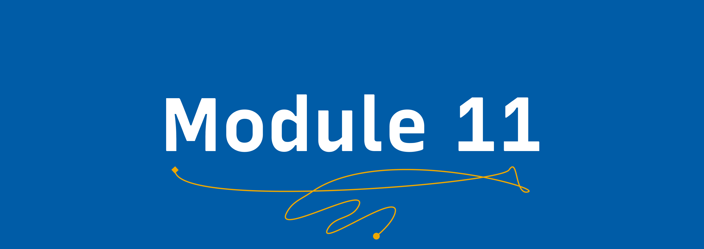

# Community impact 🥁

## Learning Goals 🥅

By the end of this module, you will:
-   Have a vision for the future of your community.
-   Have made a proposal for a change you will make in your community.
-   Be ready to submit all of your training exercises for review!

## Meet the trainers 🍎

Joe Nash and Mozzadrella deliver the content in this module.

### Vanessa (@mozzadrella)

</img>

@mozzadrella is Director, GitHub Education and manages the GitHub Education team. Prior to that, she was an Instructional Designer at GitHub Education. Her clients and partners include Mozilla, littleBits, NYU MuseEdLab. Master’s in Educational Technology from Harvard, Former researcher at the MIT Media Lab.

</img>
### Joe Nash

Joe is our former Student Program Manager at [GitHub](https://education.github.com), where his job was to tell students to capitalize the 'h' in GitHub :wink: Joe is also the former maintainer of the Campus Expert program, supporting student leaders in building tech communities on campus. Joe is an unrepentant Haskell enthusiast and has a weakness for the sparkle heart emoji 💖.

## Video 📹

[Watch the video on YouTube](https://www.youtube.com/watch?v=EM-OUYwJOEw&index=6&list=PLIRjfNq867bcqbF_DVi7iTDnc8JoWNPVT)

## Exercise 📝

In the exercise for this module, you will write a community impact proposal. This proposal defines a change that you will make to improve your community and serves as a blueprint for your time as a Campus Expert.

## Module Completion ✅

This module is complete when:
-   You have completed the impact proposal.
-   You have followed the instructions to submit.
-   A reviewer merges your pull request.

