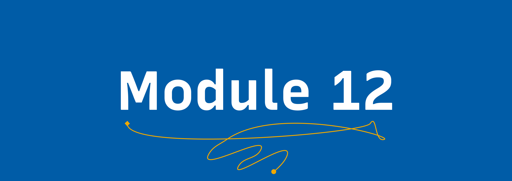

# Finishing the training 🎉

Please follow the steps in this module only **after** you have completed modules 1-12. When you are ready, follow the checklist ✅.

## Completion checklist ✅

To get you ready to finish the training, let's make sure you've done all of the following:

- [ ] I have opened a pull request.
- [ ] I have completed all of the module exercises:
    - [ ] I have committed `community-assessment.md`.
    - [ ] I have committed `inclusion-analysis.md`.
    - [ ] I have committed `workshop.md`.
    - [ ] I have committed `talk-proposal.md`.
    - [ ] I have committed `hackathon-design.md`. 
    - [ ] I have committed `program-design.md`.
    - [ ] I have committed `corporate-communication.md`.
    - [ ] I have committed `corporate-task-handling.md`.
    - [ ] I have committed `handling-documentation.md`.
    - [ ] I have committed `introduction-to-git.md`.
    - [ ] I have committed `community-impact.md`.
    - [ ] I have committed `training-completion.md`.
- [ ] I have applied the correct labels to my pull request.

( [Create a label for each module completed](https://docs.github.com/en/issues/using-labels-and-milestones-to-track-work/managing-labels) ).

If you've done all of the above, congratulations! There's just one more step to do: complete the submission form below! 

## Submission issue 🏁

Once you complete all of the exercises, you can submit them and fill a [👀 Request a training review issue](https://github.com/udictihub/udicti-leadership-student-training-program/issues/new/choose). A reviewer will then review your submission. They may have feedback that will require you to make some changes to your submission, so make sure you check back on GitHub every now and then!

This form helps the reviewers prioritize reviews and helps us improve the training for future students. Thank you for participating in Udicti Student Leadership Training and helping us make Udicti Student Leadership Training better for the future 💖.
